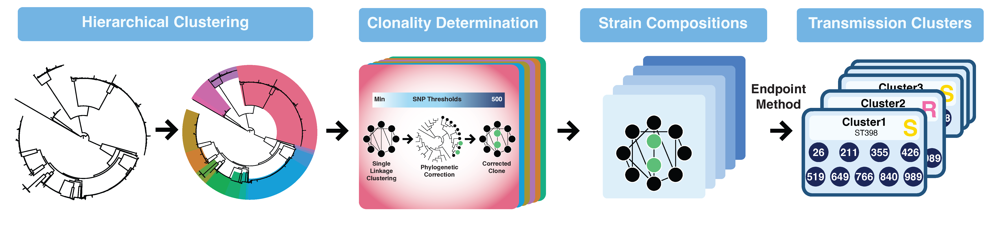
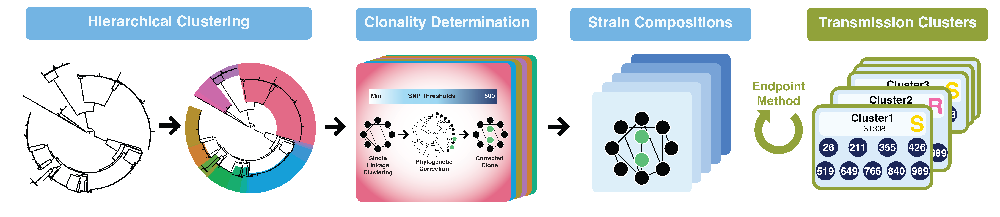
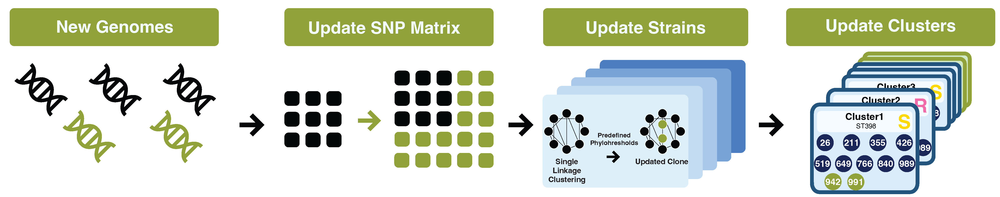
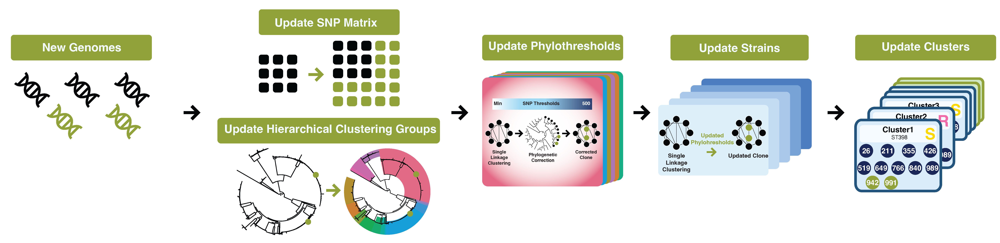
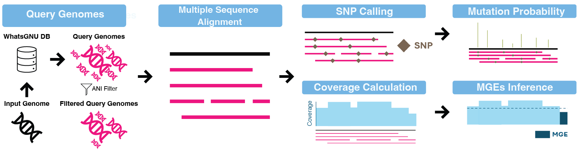

# **THRESHER**  
THRESHER is a bacterial genomics toolkit with three core functionalities:
- Strain Identifier: 
Identifies strains/transmission clusters using phylothresholds (phylogenetically-corrected SNP thresholds). 

- Genome Profiler (*Coming soon*): 
Infer substitution probabilities and mobile genetic element (MGE) dynamics leveraging publicly available genomes.

- Evolution Simulator (*Coming soon*):
Models bacterial evolution through substitution, gene gain/loss, and recombination events.

## **Workflow**  
### Strain Identifier
- Full Pipeline
  
- Redo Endpoint
  
  Elements highlighted in green (#91a01e) indicate updates applied to existing results.
- New SNPs 
  
  Elements highlighted in green (#91a01e) indicate updates applied to existing results.
- New Full 
  
  Elements highlighted in green (#91a01e) indicate updates applied to existing results.

### Genome Profiler

### Evolution Simulator (*Coming soon.*)

## Documentation
### Getting Started
- [System Requirements](docs/requirements.md)
- [Installation](docs/installation.md)
- [Quick Start](docs/quick_start.md)
### Core Functionalities
- [Strain Identifier](docs/usage_strain_identifier.md)
  - [Full Pipeline Mode](docs/usage_strain_identifier_full_pipeline.md)
  - [Redo Endpoint Mode](docs/usage_strain_identifier_redo_endpoint.md)
  - [New SNPs Mode](docs/usage_strain_identifier_new_snps.md)
  - [New Full Mode](docs/usage_strain_identifier_new_full.md)
- [Genome Profiler](docs/usage_genome_profiler.md)
- [Evolution Simulator](docs/usage_evolution_simulator.md) (*Coming soon.*)
### Advanced Usage
- [Conda Environment Management](docs/conda_environment_management.md)
- [Resuming Interrupted Runs](docs/resuming_interrupted_runs.md)

## **Development Status**
Please be advised that this pipeline is still in its early development stage. It is subject to significant changes in terms of options, outputs, and other functionalities. Users should be prepared for potential modifications and updates in future releases.

## **Author**
Qianxuan (Sean) She

  
