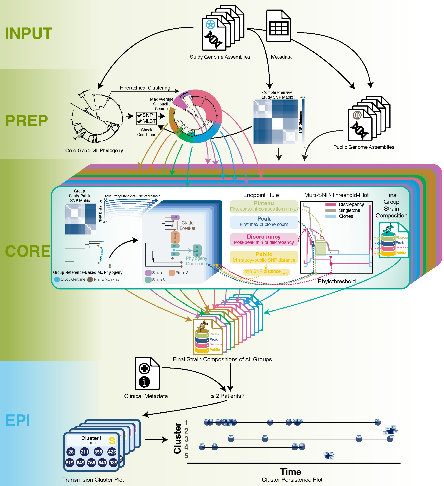

# **THRESHER**  
THRESHER is a framework that replaces fixed cutoffs with data-driven phylothresholds, the SNP thresholds corrected for phylogenetic topology and inferred directly from each dataset's genomic structure.
## **Graphical Workflow**

## Documentation
### Getting Started
- [System Requirements](docs/requirements.md)
- [Installation](docs/installation.md)
- [Quick Start](docs/quick_start.md)
### [Modes](docs/usage_thresher_overview.md)
- [Full Pipeline Mode](docs/usage_full_pipeline.md)
- [CladeBreaker OFF Mode](docs/usage_cladebreaker_off.md)
- [Redo Endpoint Mode](docs/usage_redo_endpoint.md)
- [New SNPs Mode](docs/usage_new_snps.md)
- [New Full Mode](docs/usage_new_full.md)
### Advanced Usage
- [Conda Environment Management](docs/conda_environment_management.md)
- [Resuming Interrupted Runs](docs/resuming_interrupted_runs.md)

## **Development Status**
Please be advised that this pipeline is still in its early development stage. It is subject to significant changes in terms of options, outputs, and other functionalities. Users should be prepared for potential modifications and updates in future releases.

## Authors

**Qianxuan (Sean) She**

## Acknowledgments
Developed under the mentorship of:

**Dr. Paul J. Planet**  
Email: planetp@chop.edu

**Dr. Ahmed M. Moustafa**  
Email: moustafaam@chop.edu

**Dr. Joseph P. Zackular**  
Email: joseph.zackular@pennmedicine.upenn.edu
##
