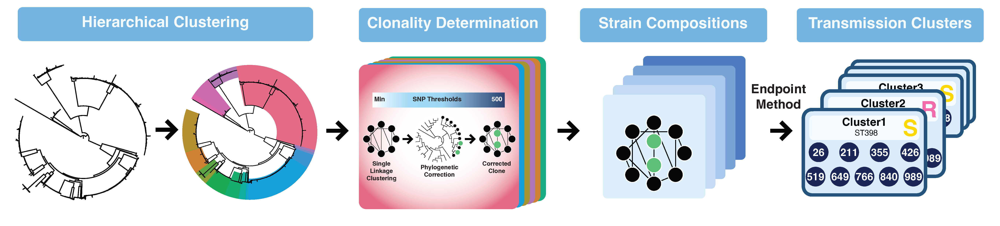
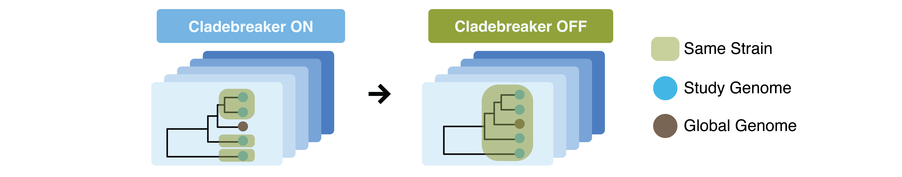
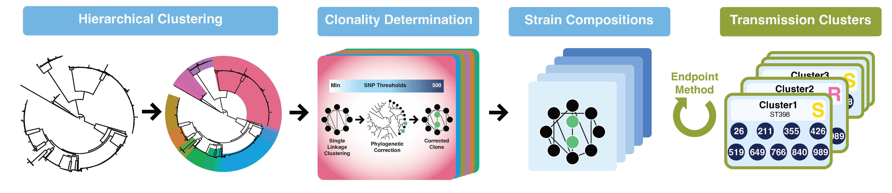
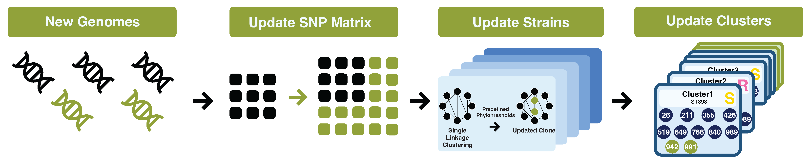
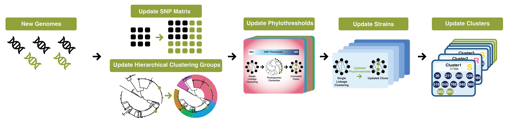

# THRESHER
Determines bacterial clonality and identifies strains/transmission clusters using phylothresholds (phylogenetically-corrected SNP thresholds).

THRESHER comprises four modes:
## **[Full Pipeline](usage_full_pipeline.md):** Run the complete analysis pipeline from scratch.


```
thresher full -h
```

## **[CladeBreaker OFF](usage_cladebreaker_off.md):** Re-identify strain composition without CladeBreaker correction

```
thresher cladebreaker-off -h
```
CladeBreaker operates on the assumption that the study genomes represent hyperlocal strains unique to the setting and absent from public databases. Under this assumption, public genomes should not be the same strain with study genomes, thereby constraining strain composition and preventing overestimation of strain size. If, however, the user has evidence that public genomes belong to the same strains as the study genomes, CladeBreaker correction should be disabled. This allows public genomes to cluster with study genomes, avoiding underestimation of strain size and overestimation of the number of strains.

## **[Redo Endpoint](usage_redo_endpoint.md):** Only rerun the final endpoint analysis using existing intermediate files.

```
thresher redo-endpoint -h
```
  - Current supported endpoints. For each hierarchical clustering group defined in the core gene tree:
    - Plateau: Phylothreshold set at a plateau where further increases no longer change the number or composition of strains within the group.
    - Peak: Phylothreshold set at the peak number of clones defined within the group.
    - Discrepancy:  Phylothreshold set at the point where the discrepancy is minimized within the group.
    - Public:  Phylothreshold set at the first time a public genome is included in any strain within the group.

## **[New SNPs](usage_new_snps.md):** Update existing strain/transmission compositions with new genomes using predefined phylothresholds.

```
thresher new-snps -h
```

## **[New Full](usage_new_full.md):** Rerun the full pipeline to update the phylothresholds, and update strain/transmission compositions with new genomes.

```
thresher new-full -h
```